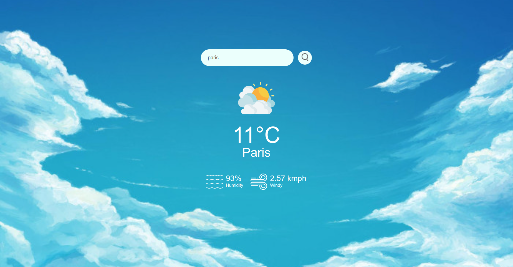

# WeatherApp
## Overview

WeatherApp is a simple web application that allows users to check the current weather conditions for a specific city. It retrieves weather data from the OpenWeatherMap API and displays it on the page.

## Features

- **Real-time Weather Data**: Fetches real-time weather data for a given city.
- **Temperature in Celsius**: Displays temperature in degrees Celsius.
- **Additional Information**: Shows humidity and wind speed.
- **Weather Icons**: Displays weather icons based on conditions.

## Screenshots




## Dependencies

OpenWeatherMap API: This project relies on the OpenWeatherMap API to fetch real-time weather data. You will need to sign up for an API key, which is used to make requests to their services.

## Technologies Used
- HTML
- CSS
- JavaScript
- OpenWeatherMap API

## Getting Started

1. Clone this repository:
   ```bash
   git clone https://github.com/thanmayee07/WeatherApp.git
2. Open the project in your code editor
3. Get an API key:
   - Visit [OpenWeatherMap](https://openweathermap.org) to get a free API key.
   - Open main.js in your code editor and locate the following line:
     ```bash
     const apiKey = "84ecf6e134b0bddeab48a363aaf447dd";
   - Replace "apiKey" with your API key.
4. Open input.html in a web browser.
5. Enter a city name in the input field and click the search button to check the weather.
